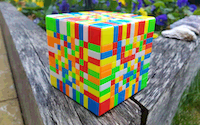

# js-steganography

A JavaScript implementation of simple image-in-image steganography.

## Try it out

This repository is statically served using [GitHub Pages](https://pages.github.com/) at https://michael-jb.github.io/js-steganography/. More details about steganography and this project are found on the home page.

## Built with

- [GitHub Pages](https://pages.github.com/) - Static hosting
- [seedrandom.js](https://github.com/davidbau/seedrandom) - Seeded pseudorandom number generation

## License

[MIT license](./LICENSE)